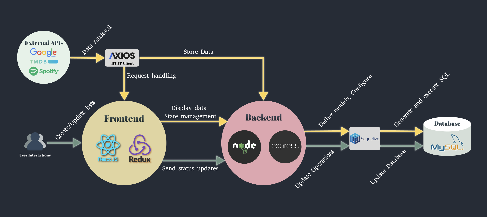

# 📚 Connect-It

**Connect-It** is a full-stack social media platform that encourages users to rediscover meaningful content consumption — such as reading books, listening to music, and watching movies — instead of scrolling endlessly on mainstream social media.

It allows users to build their own media lists, track their status, write blogs, and connect with others who enjoy similar cultural interests.

---

## 🌟 Why Connect-It?

In today's world of information overload and algorithm-driven echo chambers, **Connect-It** aims to:

- Promote mindful media consumption
- Support cultural exploration through books, music, and movies
- Provide a safe, minimalistic, and meaningful online space for sharing and personal growth

---

## ✨ Key Features

| 📌 Section           | Description |
|----------------------|-------------|
| 🔐 **Registration & Login** | Real-time username check and password confirmation |
| 👤 **User Profiles** | Edit personal info and upload profile pictures |
| 🧾 **User Page** | Display user's followers, personal lists, and blogs |
| 📝 **Interactive Lists** | Track status for books, movies, music (read/watching/listen etc.) |
| 🎵 **Music Page** | Explore popular artists and latest albums |
| 📚 **Book Page** | Browse recommended books from Google Books |
| 🎬 **Movie Page** | Discover top movies via TMDB API |
| 📰 **Blog Page** | Create and display personal blog posts |
| 🔍 **Search** | Search across books, music, movies, blogs, and users |

---

## ⚙️ System Architecture

The application is built using a modular and scalable full-stack architecture:

- **Frontend**: React + Redux + Axios
- **Backend**: Node.js + Express + Sequelize
- **Database**: MySQL
- **APIs**: Google Books, TMDB, Spotify

---

## 🛠️ Technologies Used

### Frontend
- React.js
- Redux for state management
- TinyMCE rich text editor
- Axios for HTTP requests

### Backend
- Node.js & Express for RESTful APIs
- Sequelize ORM
- JWT authentication
- Multer for file uploads

### Database
- MySQL (locally or via AWS RDS Aurora MySQL)
- Managed using Sequelize models and migrations

### APIs Integrated
- [Google Books API](https://developers.google.com/books)
- [TMDB API](https://www.themoviedb.org/documentation/api)
- [Spotify Developer API](https://developer.spotify.com)

---

## ☁️ Deployment & Hosting

This project was previously deployed on **AWS**, using the following services:

- **AWS Amplify**: CI/CD, frontend and backend hosting
- **AWS RDS (Aurora MySQL)**: Database engine
- **AWS RDS Proxy**: Connection pooling and performance optimization
- **AWS S3**: Image and static asset storage
- **CloudFront**: Global content delivery (CDN)
- **IAM**: Secure permission management

> 🛑 Due to cost considerations, the AWS deployment has been shut down.  
> You can still run the project locally by following the [SETUP.md](./SETUP.md) instructions.
---

## 📦 Installation and Setup

To install and run this project locally, follow the instructions in the [SETUP.md](./SETUP.md) file.

---

## 👩‍💻 Author

Built with ❤️ by [Miya](https://github.com/Miya-JW)